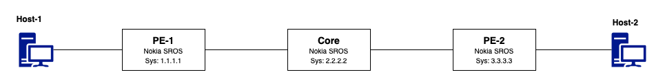
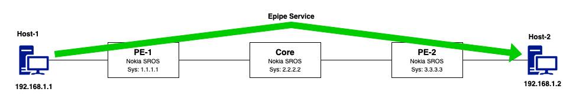

# Learn SROS

This Git repo guides you through building a 3-node network topology using containerlab. It covers initial configuration, interface setup, and routing fundamentals. You'll learn how to enable and verify IGP protocols like OSPF or IS-IS. Ideal for hands-on practice with foundational service routing concepts.

Author: Mohammad Zaman (github: mfzhsn)

## Topology



## Deploy Lab

The Lab is build using [containerlab](https://containerlab.dev) and Nokia SROS.

Build the topology, This includes nodes and links. example given `sros_lab_deploy.clab.yml`. Here, the topology is already provided as shown in the topology diagram.

## Containerlab Topology File

### Defining Nodes

```
nodes:  
    pe1:
      kind: vr-sros
      image: vr-sros:24.10.R3
      type: sr-1
      license: sros_license.txt
      mgmt-ipv4: 172.20.20.2
      # startup-config: ./configs/sros1.txt
      ports:
        - 50001:22
        - 50301:57400
        - 50401:830

```

| Field                       | Description                                                               |
| --------------------------- | ------------------------------------------------------------------------- |
| `pe1`                       | Node name; identifies this router in the topology.                        |
| `kind: vr-sros`             | Specifies the node is a virtual SR OS router using vrnetlab integration.  |
| `image: vr-sros:24.10.R3`   | Docker image to be used; version 24.10.R3 of SR OS in this case.          |
| `type: sr-1`                | Platform type; emulates Nokia's SR-1 chassis.                             |
| `license: sros_license.txt` | Path to the license file enabling full router functionality.              |
| `mgmt-ipv4: 172.20.20.2`    | Static management IP address for accessing the node.                      |
| `startup-config`            | *(Optional – currently commented out)*: Specifies initial config to load. |
| `ports`                     | Host-to-container port mappings:                                          |
| `50001:22`                  | Host port 50001 maps to SR OS SSH port (22).                              |
| `50301:57400`               | Maps to gNMI port for telemetry and automation.                           |
| `50401:830`                 | Maps to NETCONF port for model-driven configuration.                      |


### Building Links in Containerlab

The `links` section in the `topology.clab.yaml` defines how interfaces of different nodes are connected, simulating physical or logical links between them.

```yaml
links:
  - endpoints: [pe1:eth1, core:eth1]
  - endpoints: [pe2:eth2, core:eth2]
```

### Deploying the lab

```
containerlab deploy -t sros_lab_deploy.clab.yml
```

Example:

```
❯ containerlab deploy -t sros_lab_deploy.clab.yml
14:13:57 INFO Containerlab started version=0.65.0
14:13:57 INFO Parsing & checking topology file=sros_lab_deploy.clab.yml
14:13:57 INFO Creating docker network name=clab IPv4 subnet=172.20.20.0/24 IPv6 subnet=3fff:172:20:20::/64 MTU=1500
14:13:57 INFO Creating lab directory path=/home/sros_services/clab-sros-services
14:13:57 INFO Creating container name=ce2
14:13:57 INFO Using existing config file (/home/sros_services/clab-sros-services/pe2/tftpboot/config.txt) instead of applying a new one
14:13:57 INFO Creating container name=ce1
14:13:57 INFO Using existing config file (/home/sros_services/clab-sros-services/core/tftpboot/config.txt) instead of applying a new one
14:13:57 INFO Using existing config file (/home/sros_services/clab-sros-services/pe1/tftpboot/config.txt) instead of applying a new one
14:13:57 INFO Creating container name=pe2
14:13:57 INFO Creating container name=core
14:13:57 INFO Creating container name=pe1
14:13:58 INFO Created link: pe1:eth1 <--> core:eth1
14:13:58 INFO Created link: pe2:eth2 <--> core:eth2
14:13:58 INFO Created link: pe2:eth10 <--> ce2:eth1
14:13:58 INFO Created link: pe1:eth10 <--> ce1:eth1
14:13:58 INFO Executed command command="ip addr add 192.168.1.2/24 dev eth1" node=ce2 stdout=""
14:13:58 INFO Executed command command="ip link set eth1 up" node=ce2 stdout=""
14:13:58 INFO Executed command command="ip addr add 192.168.1.1/24 dev eth1" node=ce1 stdout=""
14:13:58 INFO Executed command command="ip link set eth1 up" node=ce1 stdout=""
14:13:58 INFO Adding host entries path=/etc/hosts
14:13:58 INFO Adding SSH config for nodes path=/etc/ssh/ssh_config.d/clab-sros-services.conf
🎉 A newer containerlab version (0.68.0) is available!
Release notes: https://containerlab.dev/rn/0.68/
Run 'sudo clab version upgrade' or see https://containerlab.dev/install/ for installation options.
╭──────┬─────────────────────────────────────────────┬─────────┬───────────────────╮
│ Name │                  Kind/Image                 │  State  │   IPv4/6 Address  │
├──────┼─────────────────────────────────────────────┼─────────┼───────────────────┤
│ ce1  │ linux                                       │ running │ 172.20.20.10      │
│      │ ghcr.io/mfzhsn/network-multitool-sshd:0.0.2 │         │ 3fff:172:20:20::3 │
├──────┼─────────────────────────────────────────────┼─────────┼───────────────────┤
│ ce2  │ linux                                       │ running │ 172.20.20.11      │
│      │ ghcr.io/mfzhsn/network-multitool-sshd:0.0.2 │         │ 3fff:172:20:20::2 │
├──────┼─────────────────────────────────────────────┼─────────┼───────────────────┤
│ core │ vr-sros                                     │ running │ 172.20.20.3       │
│      │ vr-sros:24.10.R3                            │         │ 3fff:172:20:20::6 │
├──────┼─────────────────────────────────────────────┼─────────┼───────────────────┤
│ pe1  │ vr-sros                                     │ running │ 172.20.20.2       │
│      │ vr-sros:24.10.R3                            │         │ 3fff:172:20:20::4 │
├──────┼─────────────────────────────────────────────┼─────────┼───────────────────┤
│ pe2  │ vr-sros                                     │ running │ 172.20.20.4       │
│      │ vr-sros:24.10.R3                            │         │ 3fff:172:20:20::5 │
╰──────┴─────────────────────────────────────────────┴─────────┴───────────────────╯
```

You can ssh using the IP provided in the above table or also use the name with default using username and password.

```
ssh admin@pe1
```


## Verification

Using containerlab to verify all the nodes are deployed

```
containerlab inspect --all
```

OR docker command

```
docker ps
```


### Layer Interfaces

```
A:admin@pe1# show router interface

===============================================================================
Interface Table (Router: Base)
===============================================================================
Interface-Name                   Adm       Opr(v4/v6)  Mode    Port/SapId
   IP-Address                                                  PfxState
-------------------------------------------------------------------------------
system                           Up        Up/Down     Network system
   1.1.1.1/32                                                  n/a
to-core                          Up        Up/Down     Network 1/1/c1/1
   10.1.1.1/31                                                 n/a
-------------------------------------------------------------------------------
Interfaces : 2
===============================================================================
```

### ISIS Adjacency

```
A:admin@pe1# show router isis adjacency

===============================================================================
Rtr Base ISIS Instance 0 Adjacency
===============================================================================
System ID                Usage State Hold Interface                     MT-ID
-------------------------------------------------------------------------------
core                     L1L2  Up    27   to-core                       0
-------------------------------------------------------------------------------
Adjacencies : 1
===============================================================================
```

### EPIPE Services

SDP:

```
A:admin@pe1# show service sdp 1

============================================================================
Service Destination Point (Sdp Id : 1)
============================================================================
SdpId  AdmMTU  OprMTU  Far End          Adm  Opr         Del     LSP   Sig
----------------------------------------------------------------------------
1      0       9190    3.3.3.3          Up   Up          MPLS    L     TLDP
============================================================================
```


EPIPE Service

```
A:admin@pe1# show service id 1 base

===============================================================================
Service Basic Information
===============================================================================
Service Id        : 1                   Vpn Id            : 0
Service Type      : Epipe
MACSec enabled    : no
Name              : 1
Description       : (Not Specified)
Customer Id       : 1                   Creation Origin   : manual
Last Status Change: 05/05/2025 19:15:41
Last Mgmt Change  : 05/05/2025 19:14:59
Test Service      : No
Admin State       : Up                  Oper State        : Up
MTU               : 1514
Vc Switching      : False
SAP Count         : 1                   SDP Bind Count    : 1
Per Svc Hashing   : Disabled            Lbl Eth/IP L4 TEID: Disabled
Ignore MTU Mismat*: Disabled
Vxlan Src Tep Ip  : N/A
Force QTag Fwd    : Disabled
Lcl Switch Svc St : sap
Oper Group        : <none>

-------------------------------------------------------------------------------
Service Access & Destination Points
-------------------------------------------------------------------------------
Identifier                               Type         AdmMTU  OprMTU  Adm  Opr
-------------------------------------------------------------------------------
sap:1/1/c10/1                            null         1514    1514    Up   Up
sdp:1:101 S(3.3.3.3)                     Spok         0       9190    Up   Up
===============================================================================
* indicates that the corresponding row element may have been truncated.
```


### Run Traffic End-to-End 



In this provided topology, Epipe service is running from PE1 through PE2 and there are hosts connected.

Ping traffic from Host-1 to Host-2

You can login to Host-1 using `docker exec` command or ssh

```
docker exec -ti host1 bash
```
OR

```
ssh root@host1
```
password: password

```
bash-5.0# ping 192.168.1.2
PING 192.168.1.2 (192.168.1.2) 56(84) bytes of data.
64 bytes from 192.168.1.2: icmp_seq=1 ttl=64 time=12.0 ms
64 bytes from 192.168.1.2: icmp_seq=2 ttl=64 time=4.83 ms
64 bytes from 192.168.1.2: icmp_seq=3 ttl=64 time=3.46 ms
64 bytes from 192.168.1.2: icmp_seq=4 ttl=64 time=3.02 ms
64 bytes from 192.168.1.2: icmp_seq=5 ttl=64 time=2.87 ms
```